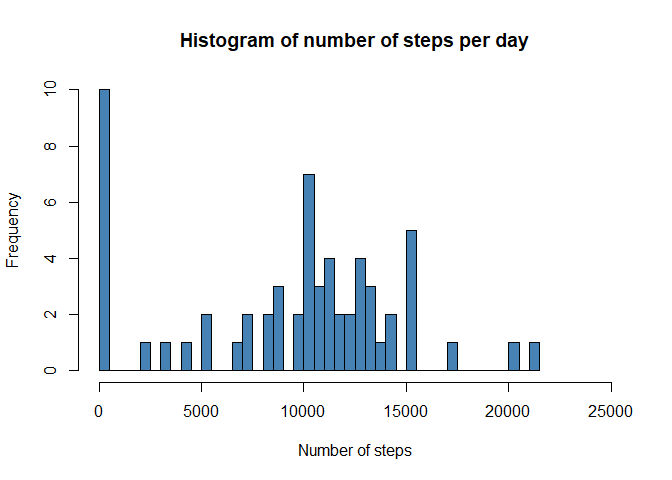
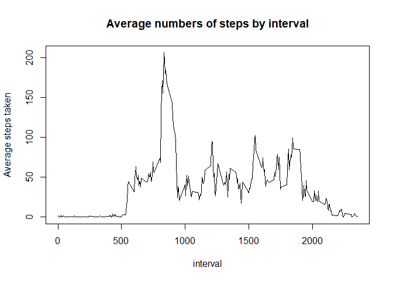
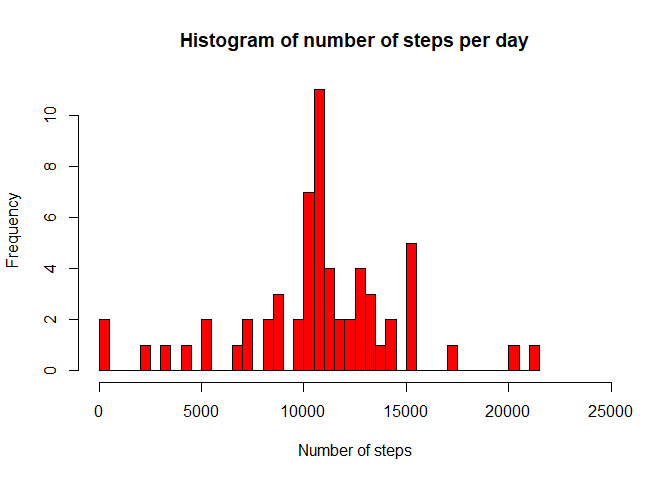
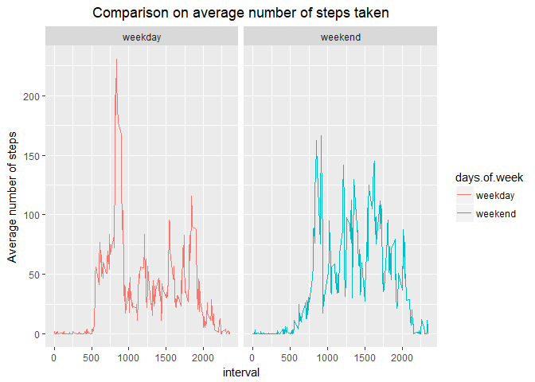

# Coursera Reproducible Research Assigment 1
Lukasz Chlystowski  
24 kwietnia 2017  


## Intro

This is an R Markdown document containing all answers for **Coursera Reproducible Reasearch Course** Week 2 Assigment.

## Initial part of the code contains 

1. Libraries used in the script
2. Getting data for the assigment,  
3. Check for existence of the data file, and 
4. unzipping downloaded file. All of that is done in working directory.


```r
library(dplyr)
library(ggplot2)

## download file from required location if file do not exist
if (!file.exists("activity.csv")) {
        file_url <- "https://d396qusza40orc.cloudfront.net/repdata%2Fdata%2Factivity.zip"
        download.file(file_url, "assigment5_2_data.zip",  method = "curl")
        unzip("assigment5_2_data.zip")
}
```

## Processing data 
1. Reading data from the file to activity data.frame
2. Creating summarized data frame for plotting histogram, removing missing values


```r
activity <- read.csv("activity.csv", colClasses = c("integer", "Date", "integer"))
steps.by.day <- summarize(group_by(activity, date), steps = sum(steps, na.rm = TRUE))
```

## Plotting histogram of the total number of steps taken each day

```r
hist(steps.by.day$steps, 
     col = "steelblue", 
     breaks = 50, 
     right = TRUE, 
     main = "Histogram of number of steps per day", 
     xlab = "Number of steps", 
     xlim = c(0, 25000))
```

<!-- -->

## Calculating mean and median of the total number of steps taken per day.

```r
mean.steps.by.day <- mean(steps.by.day$steps)
median.steps.by.day <- median(steps.by.day$steps)
```

* Mean: 9354.2295082
* Median:  10395

## Plotting time series plot of the average number of steps taken by interval

1. fist part preparing data - creating summarized data frame 

```r
steps.by.interval <- summarize(group_by(activity, interval), steps = mean(steps, na.rm = TRUE))
```
2. plotting 

```r
with(steps.by.interval, plot(interval, steps, 
                             lty = 1, type = "l", 
                             main = "Average numbers of steps by interval",
                             xlab = "interval", 
                             ylab = "Average steps taken"))
```

<!-- -->

## Finding the 5-minute interval that, on average, contains the maximum number of steps


```r
max.interval <-steps.by.interval[which.max(steps.by.interval$steps),1]
```

the 5-minute interval that, on average, contains the maximum number of steps is interval - 835

## Code to describe and show a strategy for imputing missing data

IN the data the only missing values wre number of steps taken.
I have decided to fill those missing steps with average number of steps for given interval.

 - In order to that I;ve copied **activity** data frame to new **activity2** data frame.
 - All missing values are assigned to logical **missing** vector.
 - then **activity2** data frame is filled with relevant average number of steps from **steps.by.interval** data frame. 


```r
activity2<- activity

missing <- is.na(activity$steps)

activity2$steps[missing] <- unlist(sapply(activity2$interval[missing], function(x)
                                         {
                                          return( steps.by.interval[which(steps.by.interval$interval == x),2])
                                          }
                                         ), use.names = FALSE
                                  )
```

## Histogram of the total number of steps taken each day after missing values are imputed


```r
steps.by.day.2 <- summarize(group_by(activity2, date), steps = sum(steps))

# histogram 
hist(steps.by.day.2$steps, 
     col = "red", 
     breaks = 50, 
     right = TRUE, 
     main = "Histogram of number of steps per day", 
     xlab = "Number of steps", 
     xlim = c(0, 25000))
```

<!-- -->

## Panel plot comparing the average number of steps taken per 5-minute interval across weekdays and weekends

1. In order to plot required chart I've added new column to the **activity2** data frame with two levels weekday and weekend. 
As I'm using different than english set of locales and function _weekdays()_ is using locales setting, names of week days are in different language (polish in my case).


```r
activity2$days.of.week <- as.factor(sapply(activity2$date, function(x) 
                                                        { 
                                                        if (weekdays(x)=="sobota" | 
                                                            weekdays(x)=="niedziela" 
                                                           ) { 
                                                                return("weekend")
                                                             } else {
                                                                return("weekday")
                                                                }
        
                                                        }
                                           )
                                    )
```
2. plot 

```r
steps.by.interval2 <- summarize(group_by(activity2, interval, days.of.week), steps = mean(steps))

g <- ggplot(steps.by.interval2, aes(x= interval, y = steps, 
                      col = days.of.week 
                      ))

g + geom_line(stat = "identity") + 
        facet_grid(.~days.of.week) +
        labs(x = "interval", y = "Average number of steps") + 
        labs (title = "Comparison on average number of steps taken") +
        theme(plot.title = element_text(hjust = 0.5))
```

<!-- -->

Build with R version: 3.3.2

